<div align="center">
 
</div>

<div align="center">

[](README_EN.md)
[](README.md)
<br>
[](https://hub.docker.com/r/meidlinger1024/embress)
[](LICENSE)
</div>


**EMBRESS**是一个全自动的文件重命名工具，专为**Emby**、**Jellyfin**、**Plex**等媒体库设计，可确保所有文件名称符合标准化的命名约定，以进行适当的刮削和元数据解析。

## 用前提示

请确保影视库中节目目录命名已经符合规范，如 [**/data/anime/节目XX/Season 01/AnimeXX 01 [1920x1080].mkv**](https://emby.media/support/articles/TV-Naming.html)

可通过将 **/data/anime** 映射到docker容器内目录

如 **-v /data/anime:/app/media/anime**

EMBRESS会自动将宿主机anime目录添加到影视库的遍历列表中，通过Season XX目录名，以识别出季度信息

不需要且不要去映射**电影等无需季度标识**的文件库目录！

## 功能说明

### 文件自动重命名

- 自动扫描配置的目录，按 Season XX 目录识别季度信息
- 多种正则替换规则自动应用
- 正则表达式在线调试
- 扫描日志记录
- 白名单配置，命中的文件/目录跳过处理

### AI 重命名

适用于命名混乱、正则难以覆盖的文件，借助大模型（OpenAI 兼容接口）智能改名。

使用方式：

1. 打开「模型供应商」，添加供应商（名称、模型、Base URL、API Key），点击「测试连接」确认可用，可将其中一个「设为默认」；API Key 加密存储
2. 打开「AI 重命名」，选择要使用的供应商，填写需要 AI 处理的目录（相对媒体库的路径，如 `Anime/某剧`），点击「绑定」
3. 手动扫描或等待定时扫描，绑定目录下的文件将由 AI 重命名；结果在「变更记录」中查看

效果：

- 自动识别文件名中的剧名、季数、集数，输出符合 Emby 规范的 `剧名 - SxxEyy - 分集标题.扩展名`
- 参考该剧已有的重命名记录作为命名样例，保持风格统一
- 保留原文件名中的画质、来源、字幕组标签
- 与正则流程协同：正则先处理，AI 处理剩余无法识别的文件；无法可靠识别时跳过，不会产生错误命名
- 支持多个绑定、最长前缀优先，可随时启用/停用/删除绑定

### 智能整理

自动把散落在媒体库各处的离散剧集归档到规范的 `媒体类型/剧名/Season XX` 目录，全程无需人工干预。

使用方式：

1. 在「AI 重命名」窗口底部的「自动整理」处开启开关，选择使用的模型，设置执行间隔（60-86400 秒）
2. 点击「立即整理」立即执行，或等待定时自动执行；「待整理文件」列表可预览将被处理的文件，点击「重新评估」可让暂缓文件重新参与整理
3. 执行完成后在「整理明细」中查看结果：「查看整理过程」可展开时间轴，查看 AI 判断依据与程序处理步骤；「整理变更与还原」可按剧集 / 按季 / 按片名一键还原

效果：

- 自动创建 `媒体类型/剧名/Season XX` 目录并归位文件，字幕、音频、图片、NFO 等附属文件同步移动
- 文件名中的英文名、罗马音（如 `Food Court de, Mata Ashita`）会被识别出中文剧名
- AI 只负责判断归属，创建目录、移动、重命名、清理空目录均由程序执行，安全可控
- 目标已存在同名文件时跳过，绝不覆盖
- 识别不出的文件会自动重试且不重复消耗 token；提示词或所用模型变化时自动重新评估
- 整理结果写入「变更记录」并标注「AI整理」，还原后标注「已还原」

> 提示词以独立文件维护（`python/prompts/`），修改后重启容器生效。

### 页面展示

- 仪表盘展示系统配置与扫描、整理状态
- 提供手动全部扫描和指定路径扫描
- 白名单配置和正则规则配置
- 指定路径还原重命名
- 扫描历史展示
- 文件变更记录展示（含 AI 重命名、智能整理的来源标识与还原状态）
- 查看日志


### 页面访问鉴权

- 可配置访问密钥


## 文件结构

```
embress
├── python
│   ├── app.py                      ➔ API服务与页面路由
│   ├── embress_renamer.py          ➔ 扫描与正则重命名执行
│   ├── ai_renamer.py               ➔ AI 重命名与模型供应商
│   ├── ai_organizer.py             ➔ 智能整理与还原
│   ├── prompt_loader.py            ➔ 系统提示词加载
│   ├── prompts                     ➔ 系统提示词（独立文件，可自定义）
│   │   ├── rename_system.txt       ➔ AI 重命名提示词
│   │   ├── organize_system.txt     ➔ 智能整理提示词
│   │   └── connectivity_probe.txt  ➔ 连通性测试提示词
│   ├── database.py                 ➔ 数据库存储
│   ├── crypto_utils.py             ➔ API Key 加密存储
│   ├── email_notifier.py           ➔ 邮件通知
│   ├── logging_utils.py            ➔ 日志配置
│   ├── requirements.txt            ➔ python依赖
│   ├── templates
│   │   └── index.html              ➔ 前端面板
│   └── static                      ➔ 静态文件目录
│        ├── css                    ➔ 样式（app.css / theme.css）
│        ├── img                    ➔ 图标资源
│        └── js
│            └── main.js            ➔ 前端逻辑
├── docs
│   ├── imgs                        ➔ 项目 Logo
│   └── screenshots                 ➔ 界面截图
├── conf
│   ├── supervisord.conf            ➔ supervisord进程配置
│   └── regex_pattern.json          ➔ 默认正则配置
├── Dockerfile                      ➔ 打包配置
└── docker-compose.yml              ➔ docker构建配置，宿主机要先创建对应目录
  
```

## 部署说明


### 拉取镜像

```
docker pull meidlinger1024/embress:latest
```
### docker run配置

```

docker run -d \
  --name embress \
  -p 15000:15000 \
  -v ${media_path1}:/app/media/path1 \
  -v ${media_path2}:/app/media/path2 \
  -v ${logs_path}:/app/python/logs \
  -v ${conf_path}:/app/conf \
  -e TZ=Asia/Shanghai \
  -e ACCESS_KEY=${ACCESS_KEY} \
  -e MEDIA_PATH=/app/media \
  -e CONFIG_DB_PATH=/app/conf/config.db \
  -e DEFAULT_REGEX_PATH=/app/conf/regex_pattern.json \
  -e LOG_PATH=/app/python/logs \
  -e SCAN_INTERVAL=3600 \
  -e EMAIL_ENABLED=false \
  -e EMAIL_HOST=mail.163.com \
  -e EMAIL_PORT=465 \
  -e EMAIL_USER=from@mail.com \
  -e EMAIL_PASSWORD=password \
  -e EMAIL_RECIPIENTS=to@mail.com \
  -e AI_BASE_URL=https://api.openai.com/v1 \
  -e AI_API_KEY=${AI_API_KEY} \
  -e AI_MODEL=gpt-4o-mini \
  -e AUTO_ORGANIZE_INTERVAL=3600 \
  meidlinger1024/embress:latest
```

${media_path1}：影视库目录1

${media_path2}：影视库目录2

${logs_path}：python日志目录，扫描记录持久化目录

${ACCESS_KEY}：访问秘钥

SCAN_INTERVAL：扫描间隔，单位秒

MEDIA_PATH:容器影视库根目录，默认是/app/media

CONFIG_DB_PATH:数据库存储目录，默认/app/conf/config.db

DEFAULT_REGEX_PATH:默认正则表达式配置，默认/app/conf/regex_pattern.json

LOG_PATH:程序日志配置，默认/app/python/logs

EMAIL_ENABLED:邮箱通知启用配置，默认false

AI_BASE_URL:AI 接口地址（OpenAI 兼容），默认 https://api.openai.com/v1

AI_API_KEY:AI 接口密钥，也可在页面的「模型供应商」中添加（推荐，加密存储）

AI_MODEL:默认模型名，默认 gpt-4o-mini

AI_TIMEOUT:AI 请求超时时间（秒），默认 60

AI_MAX_FILES:单次交给 AI 处理的文件数上限，默认 80

AUTO_ORGANIZE_INTERVAL:智能整理的默认执行间隔（秒），默认 3600

AUTO_ORGANIZE_TTL:智能整理对无法识别文件的暂缓时长（秒），超时后重新评估，默认 86400

EMBRESS_SECRET_KEY / EMBRESS_KEY_PATH:用于加密存储 API Key 的密钥，建议持久化 conf 目录或显式指定

### docker-compose配置
```
version: "3"
services:
  embress:
    image: meidlinger1024/embress:latest
    container_name: embress
    restart: always
    ports:
      - "15000:15000"
    volumes:
      - _media_path1:/app/media/path1
      - _media_path2:/app/media/path2
      - _logs_path:/app/python/logs
      - _conf_path:/app/conf
    environment:
      - TZ=Asia/Shanghai
      - ACCESS_KEY=ACCESS_KEY
      - MEDIA_PATH=/app/media
      - CONFIG_DB_PATH=/app/conf/config.db
      - DEFAULT_REGEX_PATH=/app/conf/regex_pattern.json
      - LOG_PATH=/app/python/logs
      - SCAN_INTERVAL=3600
      - EMAIL_ENABLED=false
      - EMAIL_HOST=mail.163.com
      - EMAIL_PORT=465
      - EMAIL_USER=from@mail.com
      - EMAIL_PASSWORD=password
      - EMAIL_RECIPIENTS=to@mail.com
      - AI_BASE_URL=https://api.openai.com/v1
      - AI_API_KEY=AI_API_KEY
      - AI_MODEL=gpt-4o-mini
      - AUTO_ORGANIZE_INTERVAL=3600
```

## 界面截图

<div align="center">
 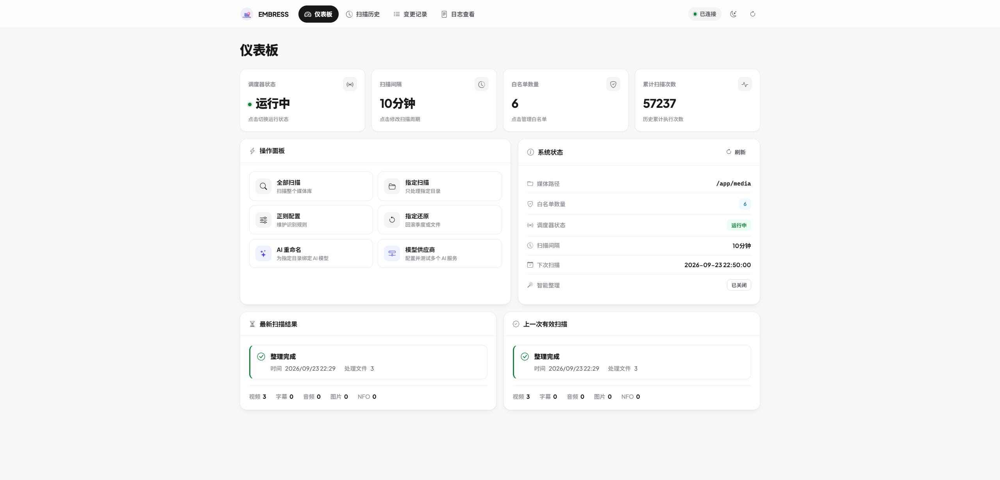
 <p>仪表板</p>
</div>
<div align="center">
 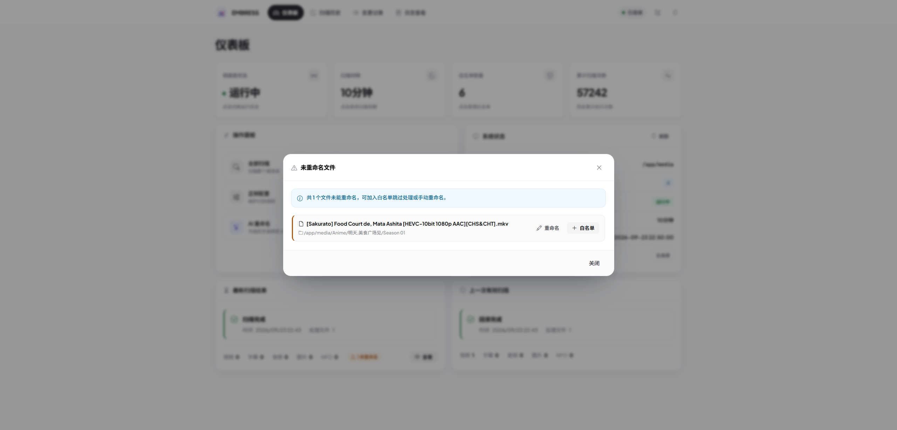
 <p>未重命名文件</p>
</div>
<div align="center">
 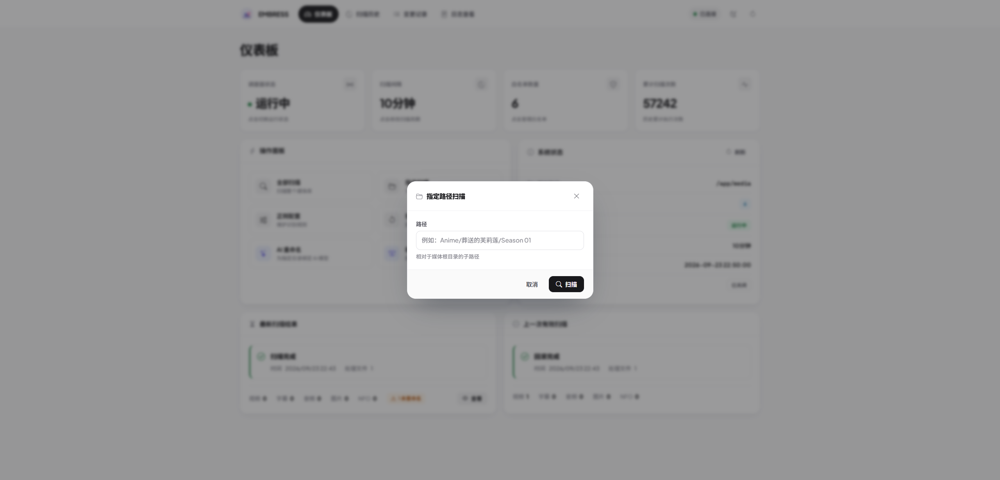
 <p>指定路径扫描</p>
</div>
<div align="center">
 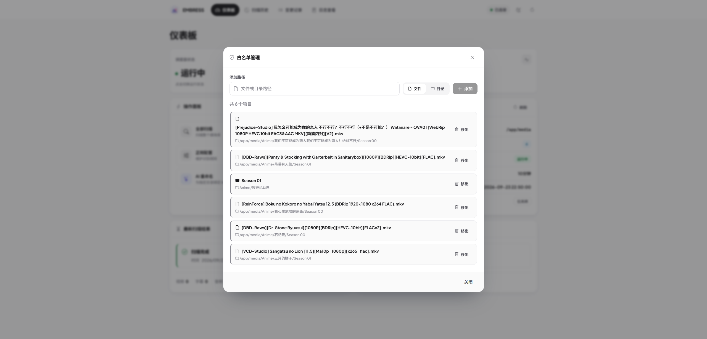
 <p>白名单管理</p>
</div>
<div align="center">
 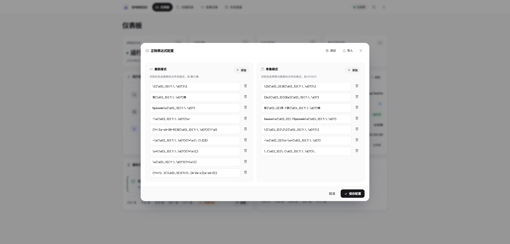
 <p>正则配置</p>
</div>
<div align="center">
 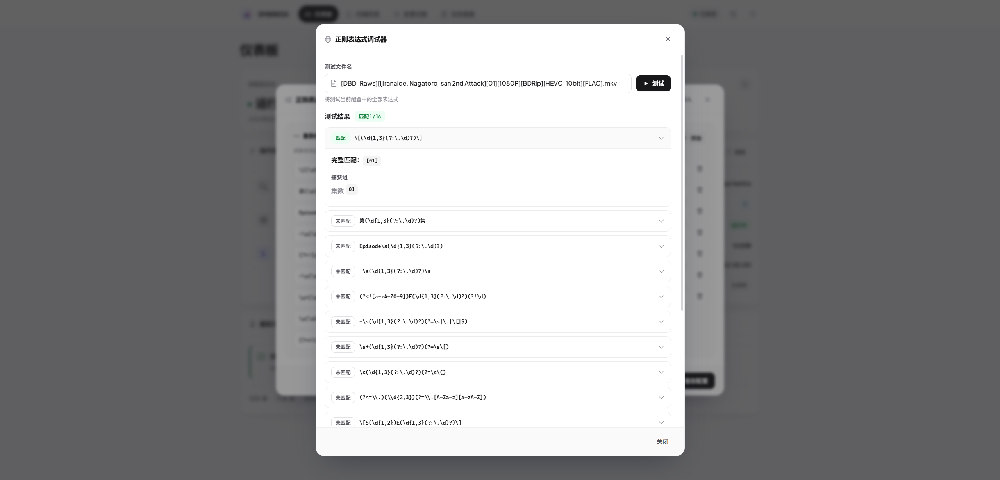
 <p>正则调试器</p>
</div>
<div align="center">
 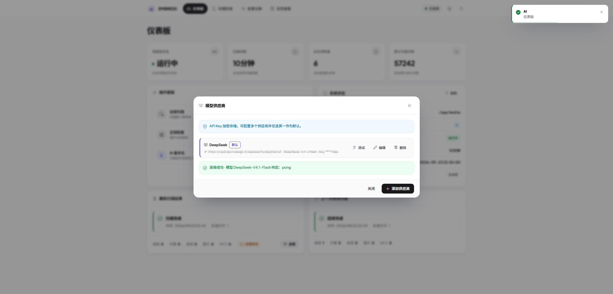
 <p>模型供应商</p>
</div>
<div align="center">
 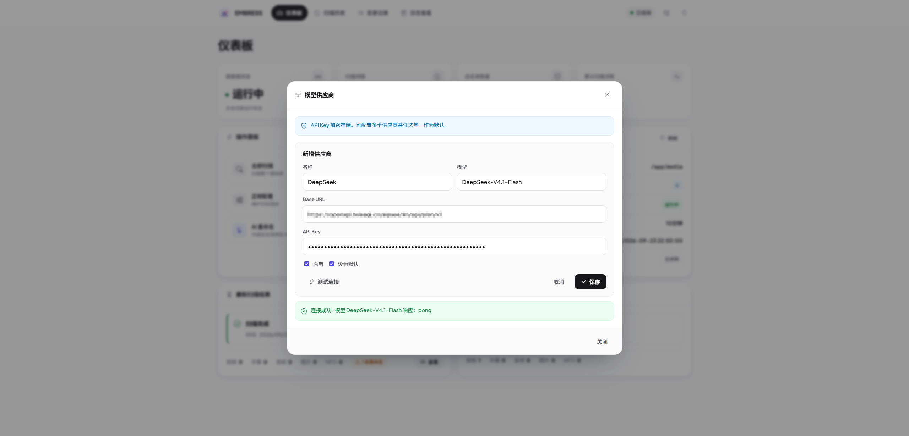
 <p>新增供应商</p>
</div>
<div align="center">
 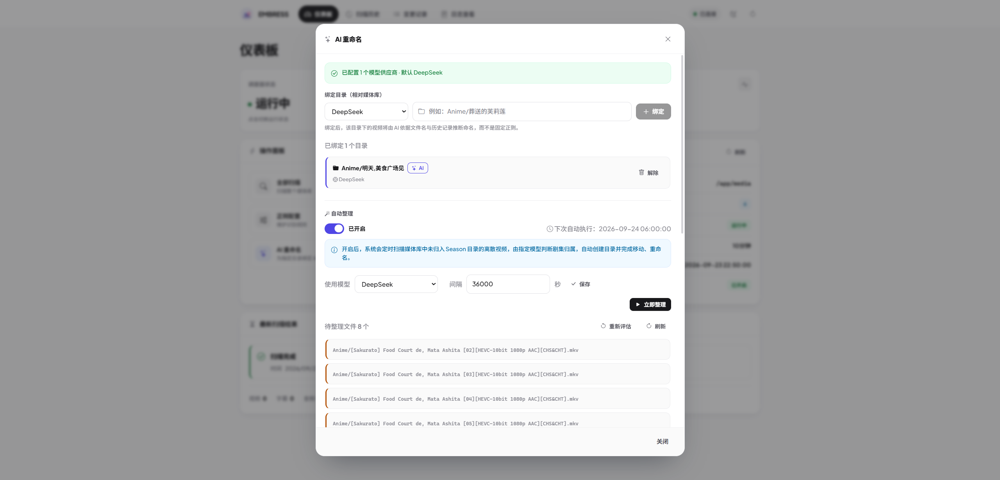
 <p>AI 重命名</p>
</div>
<div align="center">
 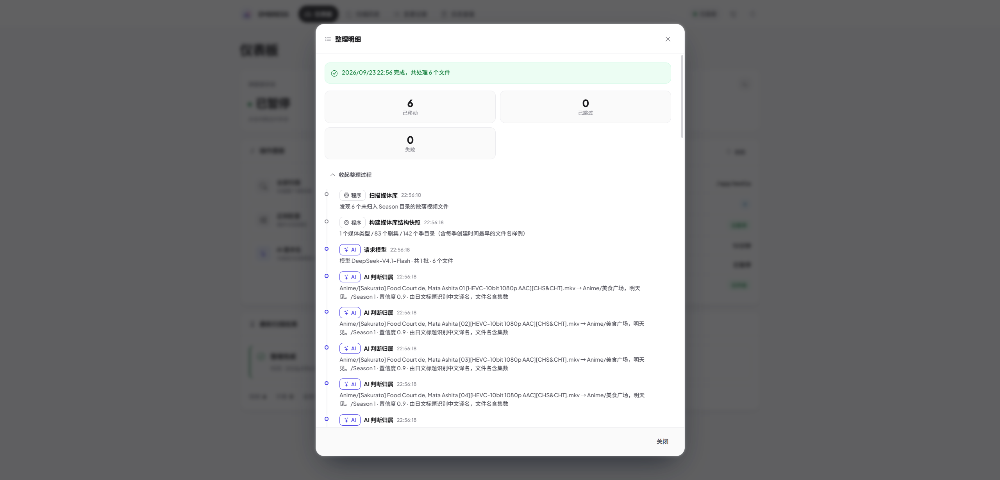
 <p>整理过程</p>
</div>
<div align="center">
 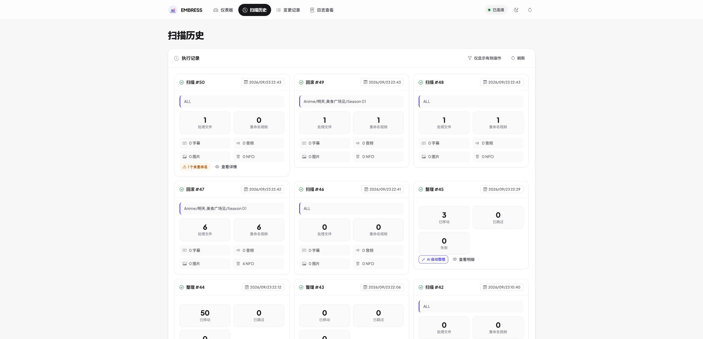
 <p>扫描历史</p>
</div>
<div align="center">
 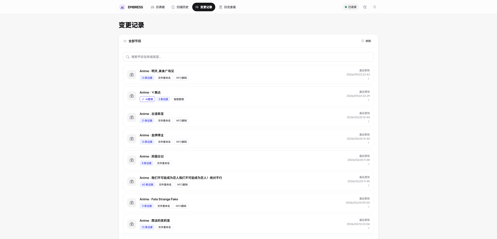
 <p>变更记录</p>
</div>
<div align="center">
 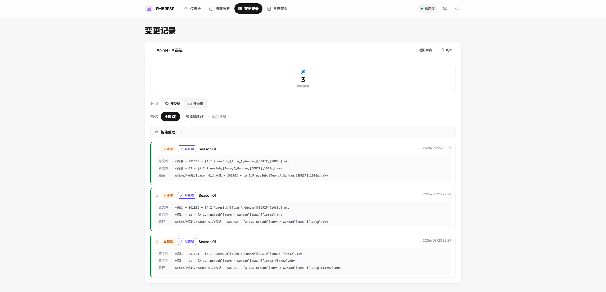
 <p>整理还原</p>
</div>
<div align="center">
 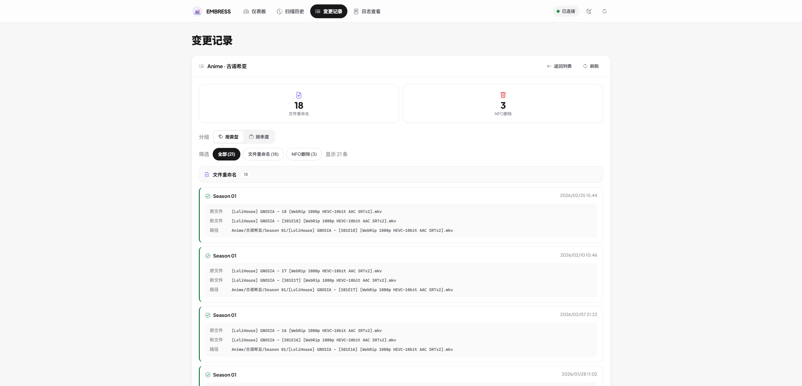
 <p>重命名记录</p>
</div>
<div align="center">
 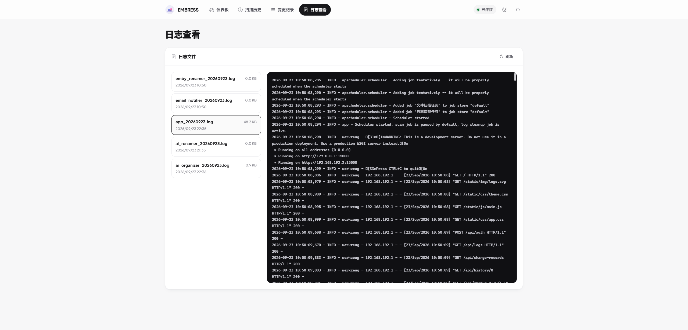
 <p>日志查看</p>
</div>
