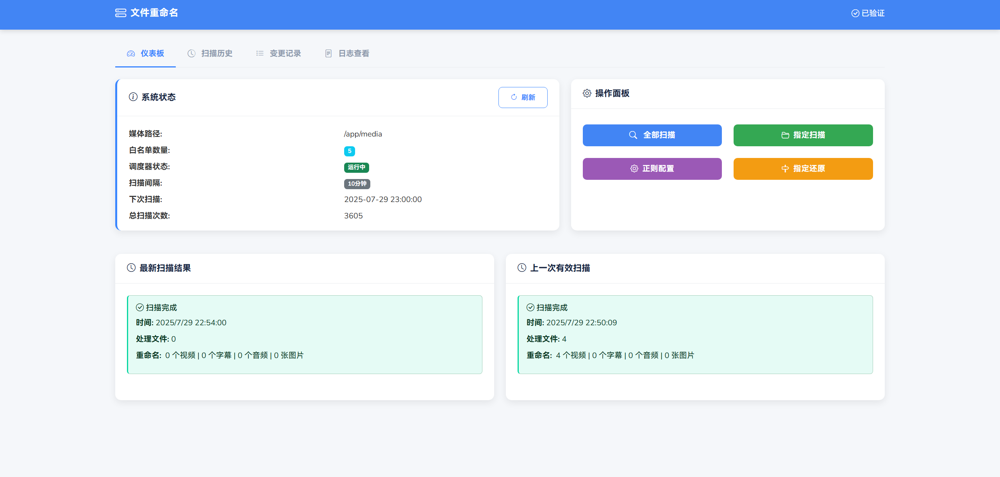
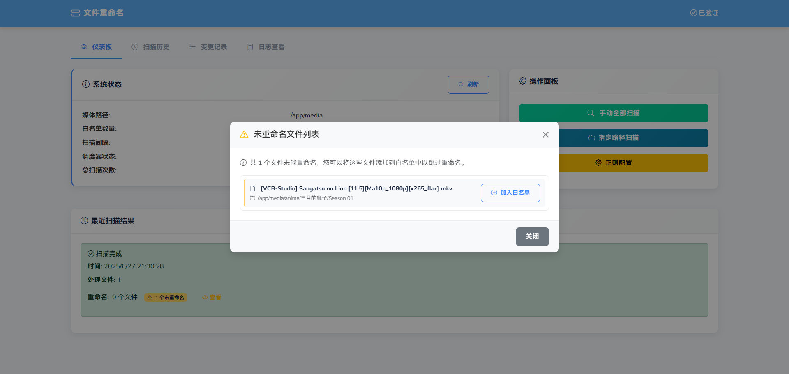
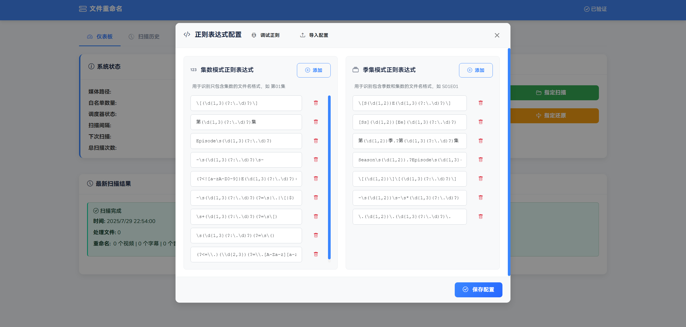
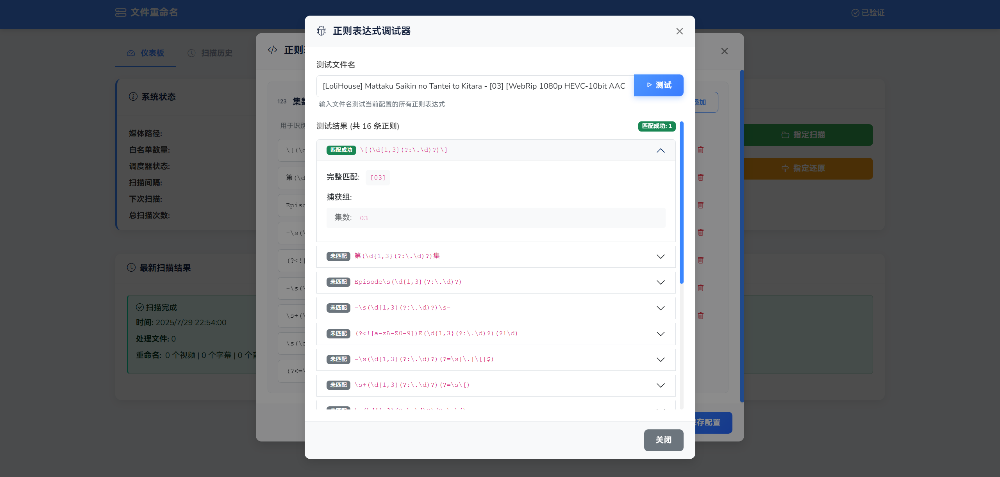
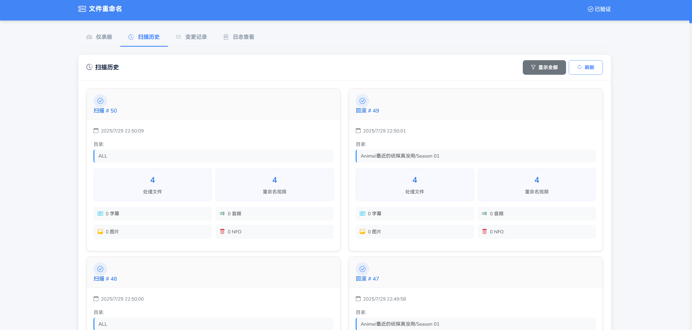
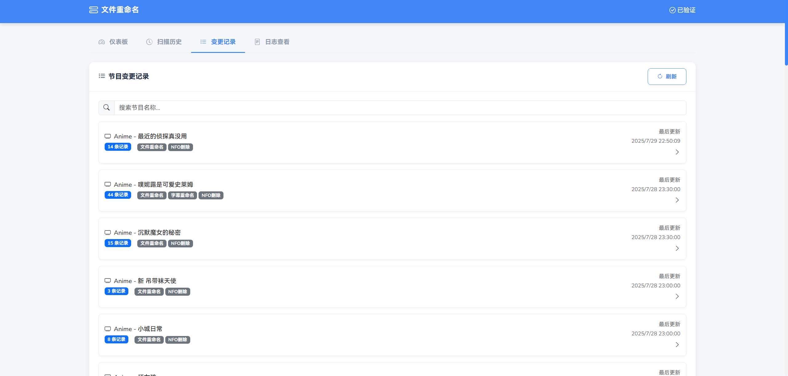
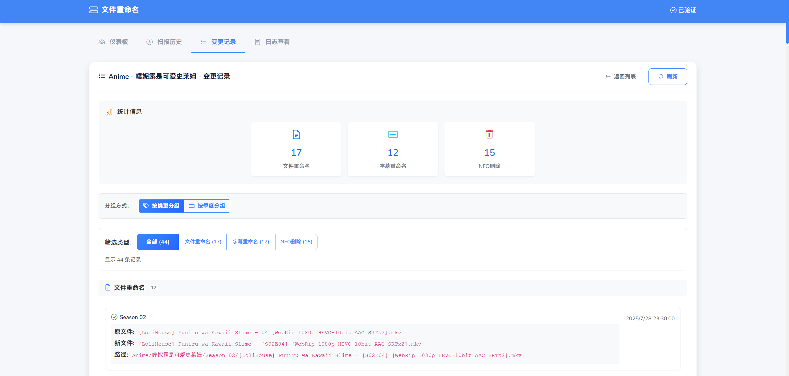

<div align="center">
 
</div>

<div align="center">

[](README_EN.md)
[](README.md)
<br>
[](https://hub.docker.com/r/meidlinger1024/embress)
[](LICENSE)
</div>


**EMBRESS**是一个全自动的文件重命名工具，专为**Emby**、**Jellyfin**、**Plex**等媒体库设计，可确保所有文件名称符合标准化的命名约定，以进行适当的刮削和元数据解析。

## 🎗️ 用前提示

请确保影视库中节目目录命名已经符合规范，如 [**/data/anime/节目XX/Season 01/AnimeXX 01 [1920x1080].mkv**](https://emby.media/support/articles/TV-Naming.html)

可通过将 **/data/anime** 映射到docker容器内目录

如 **-v /data/anime:/app/media/anime**

EMBRESS会自动将宿主机anime目录添加到影视库的遍历列表中，通过Season XX目录名，以识别出季度信息

不需要且不要去映射**电影等无需季度标识**的文件库目录！

## 🔰 功能说明


### 文件自动重命名

- 自动扫描配置的目录
- 多种正则替换规则自动应用
- 正则表达式在线调试
- 扫描日志记录
- 白名单配置


### 页面展示

- 仪表盘展示系统配置
- 提供手动全部扫描和指定路径扫描
- 白名单配置和正则规则配置
- 指定路径还原重命名
- 扫描历史展示
- 文件变更记录展示
- 查看日志


### 页面访问鉴权

- 可配置访问密钥


## 文件结构

```
embress
├── python
│   │ 
│   ├── app.py                      ➔ API服务
│   ├── embress_rename.py           ➔ 重命名执行
│   ├── database.py                 ➔ 数据库存储
│   ├── requirements.txt            ➔ python依赖
│   ├── templates
│   │   └── index.html              ➔ 前端面板
│   └── static                      ➔ 静态文件目录
│        ├── css
│        │   └── styles.css
│        └── js
│            └── main.js
├── conf
│   ├── supervisord.conf            ➔ supervisord进程配置
│   └── regex_pattern.json          ➔ 默认正则配置
├── Dockerfile                      ➔ 打包配置
└── docker-compose.yml              ➔ docker构建配置，宿主机要先创建对应目录
  
```

## 🐳 部署说明


### 拉取镜像

```
docker pull meidlinger1024/embress:latest
```
### docker run配置

```

docker run -d \
  --name embress \
  -p 15000:15000 \
  -v ${media_path1}:/app/media/path1 \
  -v ${media_path2}:/app/media/path2 \
  -v ${logs_path}:/app/python/logs \
  -v ${conf_path}:/app/conf \
  -e TZ=Asia/Shanghai \
  -e ACCESS_KEY=${ACCESS_KEY} \
  -e MEDIA_PATH=/app/media \
  -e CONFIG_DB_PATH=/app/conf/config.db \
  -e DEFAULT_REGEX_PATH=/app/conf/regex_pattern.json \
  -e LOG_PATH=/app/python/logs \
  -e SCAN_INTERVAL=3600 \
  -e EMAIL_ENABLED=false \
  -e EMAIL_HOST=mail.163.com \
  -e EMAIL_PORT=465 \
  -e EMAIL_USER=from@mail.com \
  -e EMAIL_PASSWORD=password \
  -e EMAIL_RECIPIENTS=to@mail.com \
  meidlinger1024/embress:latest
```

${media_path1}：影视库目录1

${media_path2}：影视库目录2

${logs_path}：python日志目录，扫描记录持久化目录

${ACCESS_KEY}：访问秘钥

SCAN_INTERVAL：扫描间隔，单位秒

MEDIA_PATH:容器影视库根目录，默认是/app/media

CONFIG_DB_PATH:数据库存储目录，默认/app/conf/config.db

DEFAULT_REGEX_PATH:默认正则表达式配置，默认/app/conf/regex_pattern.json

LOG_PATH:程序日志配置，默认/app/python/logs

EMAIL_ENABLED:邮箱通知启用配置，默认false

### docker-compose配置
```
version: "3"
services:
  embress:
    image: meidlinger1024/embress:latest
    container_name: embress
    restart: always
    ports:
      - "15000:15000"
    volumes:
      - _media_path1:/app/media/path1
      - _media_path2:/app/media/path2
      - _logs_path:/app/python/logs
      - _conf_path:/app/conf
    environment:
      - TZ=Asia/Shanghai
      - ACCESS_KEY=ACCESS_KEY
      - MEDIA_PATH=/app/media
      - CONFIG_DB_PATH=/app/conf/config.db
      - DEFAULT_REGEX_PATH=/app/conf/regex_pattern.json
      - LOG_PATH=/app/python/logs
      - SCAN_INTERVAL=3600
      - EMAIL_ENABLED=false
      - EMAIL_HOST=mail.163.com
      - EMAIL_PORT=465
      - EMAIL_USER=from@mail.com
      - EMAIL_PASSWORD=password
      - EMAIL_RECIPIENTS=to@mail.com
```

## 🧩 界面截图

<div align="center">
 
</div>
<div align="center">
 
</div>
<div align="center">
 
</div>
<div align="center">
 
</div>
<div align="center">
 
</div>
<div align="center">
 
</div>
<div align="center">
 
</div>
<div align="center">
 
</div>
<div align="center">
 
</div>
<div align="center">
 
</div>
