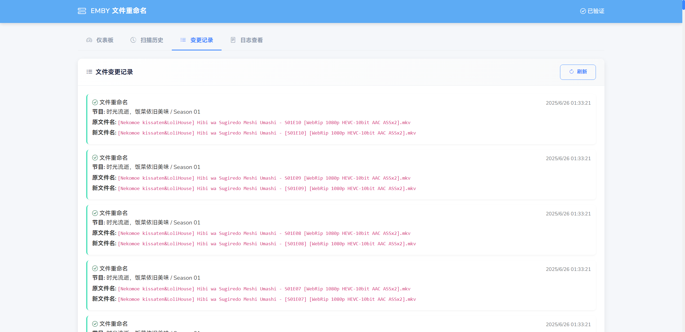

# EMBRESS

<div align="center">

[](README_EN.md)
[](README.md)
<br>
[](https://hub.docker.com/r/meidlinger1024/embress)
[](LICENSE)
</div>


**EMBRESS**是一个全自动的文件重命名工具，专为**Emby**、**Jellyfin**、**Plex**等媒体库设计，可确保所有文件名称符合标准化的命名约定，以进行适当的刮擦和元数据解析。

## 🔰 功能说明


### 文件自动重命名

自动扫描配置的目录
多种正则替换规则自动应用
扫描日志记录

### 页面展示

仪表盘展示系统配置
提供手动全部扫描和指定路径扫描
扫描历史展示
文件变更记录展示
查看日志


### 页面访问鉴权

可配置访问密钥

### 文件结构

```
embress
├── python
│   │ 
│   ├── app.py                      ➔ API服务
│   ├── embress_rename.py           ➔ 重命名业务
│   ├── requirements.txt            ➔ python依赖
│   ├── conf
│   │   └── regex_patterns.json     ➔ 正则配置
│   ├── templates
│   │   └── index.html              ➔ 前端面板
│   └── static                      ➔ 静态文件目录
│        ├── css
│        │   └── styles.css
│        └── js
│            ├── main.js
│            └── vue.js
│     
│     
├── conf
│   └── supervisord.conf            ➔ supervisord进程配置
├── Dockerfile                      ➔ 打包配置
└── docker-compose.yml              ➔ docker构建配置，宿主机要先创建对应目录
  
```

## 🐳 部署说明


### 拉取镜像

```
docker pull meidlinger1024/embress:latest
```
### docker run配置

```

docker run -d \
  --name embress \
  -p 15000:15000 \
  -v ${media_path1}:/app/media/path1 \
  -v ${media_path2}:/app/media/path2 \
  -v ${logs_path}:/app/python/logs \
  -v ${conf_path}/regex_patterns.json:/app/python/conf/regex_patterns.json \
  -e TZ=Asia/Shanghai \
  -e ACCESS_KEY=${ACCESS_KEY} \
  -e MEDIA_PATH=/app/media \
  -e REGEX_PATH=/app/python/conf/regex_patterns.json \
  -e SCAN_INTERVAL=3600 \
  embress:latest
```

### docker-compose配置
```
version: '3'
services:
  embress:
    image: embress:1.0.0
    container_name: embress
    restart: always
    ports:
      - "15000:15000"
    volumes:
      - ${media_path1}:/app/media/path1
      - ${media_path2}:/app/media/path2
      - ${logs_path}:/app/python/logs
      - ${conf_path}/regex_patterns.json:/app/python/conf/regex_patterns.json
    environment:
      - TZ=Asia/Shanghai
      - ACCESS_KEY=${ACCESS_KEY}
      - MEDIA_PATH=/app/media
      - REGEX_PATH=/app/python/conf/regex_patterns.json
      - SCAN_INTERVAL=3600
```

## 🧩 界面截图





