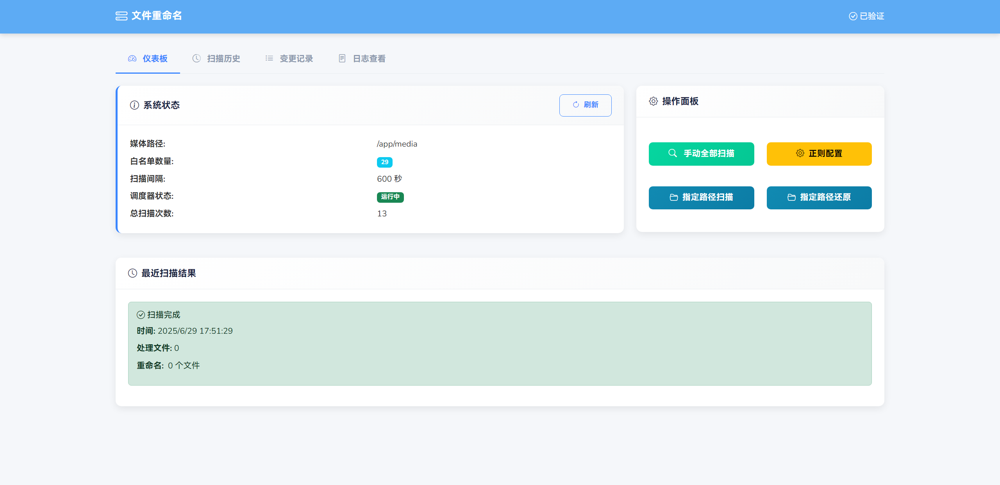

# EMBRESS

<div align="center">

[](README_EN.md)
[](README.md)
<br>
[](https://hub.docker.com/r/meidlinger1024/embress)
[](LICENSE)
</div>

---

## 🔰 Overview

**EMBRESS** is a fully automated file renaming tool designed for media libraries such as **Emby**, **Jellyfin**, or **Plex**, ensuring all file names conform to standardized naming conventions for proper scraping and metadata parsing.

---

## 🚀 Features


### 📁 Auto-Renaming

- Scheduled directory scanning
- Automatically apply regex rules for filename rewriting
- Logging for scan and rename operations

### 📊 Web Dashboard

- System configuration overview
- Manual or targeted scan triggering
- Scan history records
- Rename history tracking
- Log viewer

### 🔐 Access Control

- Optional access key for UI protection

### 📁 Project Structure

```
embress
├── python
│   │ 
│   ├── app.py                      ➔ API server
│   ├── embress_rename.py           ➔ rename logic
│   ├── requirements.txt            ➔ Python dependencies
│   ├── conf
│   │   └── regex_patterns.json     ➔ Regex config file
│   ├── templates
│   │   └── index.html              ➔ Dashboard UI
│   └── static                      ➔ Static resources
│        ├── css
│        │   └── styles.css 
│        └── js
│            ├── main.js
│            └── vue.js
│     
│     
├── conf
│   └── supervisord.conf            ➔ Supervisor config
├── Dockerfile                      ➔ Docker build file
└── docker-compose.yml              ➔ Compose file
  
```

## 🐳 Deployment Guide

### Pull Docker Image

```
docker pull meidlinger1024/embress:latest
```

### Run with Docker

```

docker run -d \
  --name embress \
  -p 15000:15000 \
  -v ${media_path1}:/app/media/path1 \
  -v ${media_path2}:/app/media/path2 \
  -v ${logs_path}:/app/python/logs \
  -e TZ=Asia/Shanghai \
  -e ACCESS_KEY=${ACCESS_KEY} \
  -e MEDIA_PATH=/app/media \
  -e REGEX_PATH=/app/python/conf/regex_patterns.json \
  -e WHITELIST_PATH=/app/python/conf/whitelist.json \
  -e SCAN_INTERVAL=3600 \
  embress:latest
```

${media_path1}: Media library directory 1

${media_path2}: Media library directory 2

${logs_path}: Python logs directory, scan record persistence directory

${ACCESS_KEY}: Access key

SCAN_INTERVAL: Scan interval in seconds

MEDIA_PATH: Container media library root directory (default: /app/media)

REGEX_PATH: Program regex configuration path (default: /app/python/conf/regex_patterns.json)

WHITELIST_PATH: Program filename whitelist configuration path (default: /app/python/conf/whitelist.json)

### Run with Docker Compose
```
version: '3'
services:
  embress:
    image: embress:latest
    container_name: embress
    restart: always
    ports:
      - "15000:15000"
    volumes:
      - ${media_path1}:/app/media/path1
      - ${media_path2}:/app/media/path2
      - ${logs_path}:/app/python/logs
    environment:
      - TZ=Asia/Shanghai
      - ACCESS_KEY=${ACCESS_KEY}
      - MEDIA_PATH=/app/media
      - REGEX_PATH=/app/python/conf/regex_patterns.json
      - WHITELIST_PATH=/app/python/conf/whitelist.json
      - SCAN_INTERVAL=3600
```

## 🧩 界面截图




